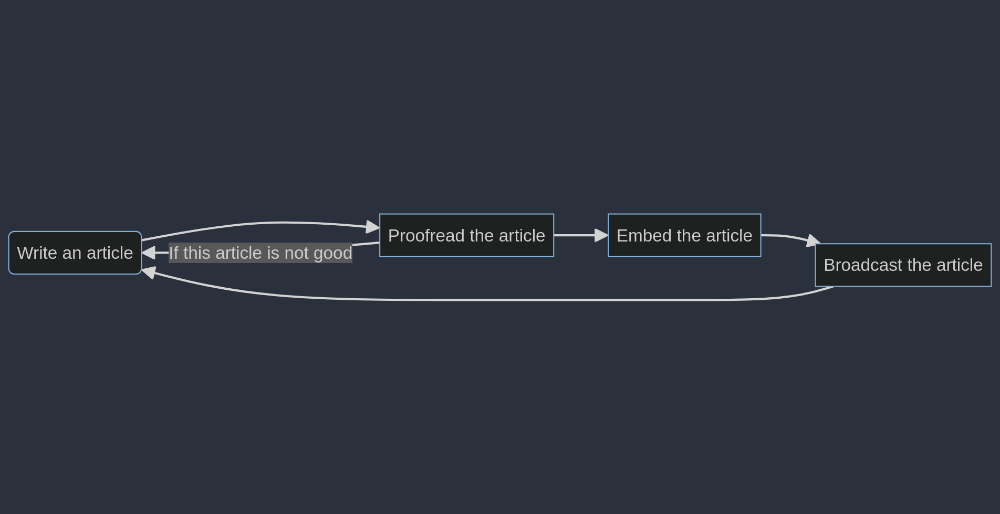

# Le patron État 
**Objectif** : Gérer les comportements dépendant du cycle de vie

**Exemple** : Vous êtes rédacteur en chef dans un journal dont le 
cycle de vie est toujours le même : 
- Un journaliste écrit un article qu'il soumet à la relecture 
- Si la relecture est convaincante l'article est embelli 
- Sinon le journaliste le récrit 
- Lorsqu'un article est embelli, il paraît
- Un journaliste écrit un nouvel article, etc.

**Solution** : Chaque nœud de notre graphe représente un état. 
Un état peut en amener à plusieurs autres de sorte que chaque 
état puisse avoir une solution `after` et `before`. Dans l'exemple
de la relecture `after` serait l'embellissement de l'article et `before`
serait sa réécriture. Mais attente l'embellissement de l'article ne possède 
pas de `before`, un article embelli ne peut être relu.

Il faut donc créer une classe `Redaction` qui possède un attribut 
`state` de classe `State`. La classe `State` serait une interface 
possédant les méthodes `before` et `after` qui renvoie toutes deux 
vers des fils de `State`. Chaque état concret étant une classe fille 
de `State`.